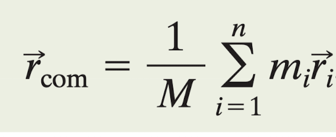

# Centro de Massa
- O centro de massa de uma estrutura é o ponto em que o peso do sistema pode ser considerado concentrado, para fins de análise estática e dinâmica.
- No caso de uma distribuição uniforme de massa, o centro de massa coincidirá com o centro geométrico. 
- Quando a distribuição de massa não é uniforme, ele será deslocado em direção às regiões mais pesadas.
- Fórmula no ambiente de 3 dimensões:
    - Para sistema de 2 massas pontuais:
        - $ x_{c \, m} = \frac{x_{massa1} + x_{massa2}}{massa1 + massa2} $
        - $ y_{c \, m} = \frac{y_{massa1} + y_{massa2}}{massa1 + massa2} $ 
        - $ z_{c \, m} = \frac{z_{massa1} + z_{massa2}}{massa1 + massa2} $ 

## Centro de massa para muitas partículas:
- Fórmula no ambiente de 3 dimensões:
    - Para sistema de 2 massas pontuais:
        - $ x_{c \, m} = \frac{x_{massa1} + x_{massa2} + x_{massa} ... + x_{massaN}}{massa1 + massa2 + massa3 + ... + massaN} $
        - $ y_{c \, m} = \frac{y_{massa1} + y_{massa2} + y_{massa} ... + y_{massaN}}{massa1 + massa2 + massa3 + ... + massaN} $
        - $ z_{c \, m} = \frac{z_{massa1} + z_{massa2} + z_{massa} ... + z_{massaN}}{massa1 + massa2 + massa3 + ... + massaN} $
- Sendo
    - X(com): posição, no eixo X, do centro de massa do sistema m1-m2-m3...mn
    - m1: massa do corpo 1
    - m2: massa do corpo 2
    - m3: massa do corpo 3
    - mn: massa do corpo n
    - M: somatório de todas as massas do sistema considerado
    - x1: posição, no eixo X, do corpo 1
    - x2: posição, no eixo X, do corpo 2
    - x3: posição, no eixo X, do corpo 3
    - xn: posição, no eixo X, do corpo n

## Centro de massa no espaço de 3 dimensões, usando vetores:

- Representação de 1 vetor:

## Centro de massa de um corpo considerado como sólido de infinitos pontos
- Na vida real, as fórmulas anteriores representam aproximações pois em um sistema de muitos corpos sólidos diferentes, nunca temos a posição de cada massa do sistema.
- Logo, acabamos por errar quando multiplicamos a posição e a massa de cada corpo.
- Mas se o corpo for simétrico e se nós temos realmente o ponto central (centro de massa) de cada corpo, nossos calculos estariam certos.
- A solução para este cálculo imperfeito é o uso da ferramenta integral da matemática.
- Logo, somos mais precisos, com a fórmula:

- Esta é a única fórmula correta pois tratamos cada corpo como uma distribuição contínua de matéria e usamos a inregral para somar todas as possíveis posições das massas, com os respectivos valores das massas. 

## Centro de massa de um corpo pelo volume do corpo considerado sua densidade como uniforme
- Consideramos apenas corpos uniformes que possuem densidade uniforme. 
- A densidade se mantem por todo o corpo.
- Cada parte do corpo tem uma massa (dm) e também um volume (dV).
- Como consideramos que o corpo é uniforme no que se considera a sua densidade, podemos afirmar que, assim como a massa pode ser considerada como uma distribuição contímnua de pequenas unidades de massa, também podemos dizer que o volume total se apresenta como uma distribuição contínua de volume.
- Da mesma forma que fizemos para a característica massa, também podemos fazer para a característica volume:

